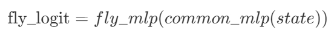
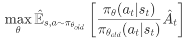

- [IortDataCollection](#iortdatacollection)
  - [一、技术栈](#一技术栈)
  - [二、代码目录](#二代码目录)
  - [三、代码进度](#三代码进度)
  - [四、代码待完成部分](#四代码待完成部分)
  - [五、核心算法设计](#五核心算法设计)

# IortDataCollection
## 一、技术栈
PPO+gymnasium
- PPO：未调用Stable_Baselines等成熟的RL代码库，自定义了神经网络结构，增加了action mask，并提供了一版PPO的clean implementation。
- gymnasium：通过继承gymnasium.Env自定义了环境，可支持multi-envs的包装。

## 二、代码目录
```sh
- discrete
|-- __init__.py
|-- agent.py
|-- config.py
|-- env.py
|-- train.py
|-- utils
```

- agent.py: 定义了智能体的神经网络结构。
- config.py: 保存了训练、环境、网络的配置参数。
- env.py: 实现了无人机数据采集的环境。
- train.py: 训练的入口函数。
- utils：其目录下的common_tools.py保存了功能函数，例如mlp生成等。

## 三、代码进度
目前已实现了：
- 参数配置、环境生成等基本的训练框架；
- 状态/动作空间的定义与实现；
- 自定义神经网络结构的实现；
- 动作掩码生成的实现。

## 四、代码待完成部分
1. 训练过程：包含经验采集与模型更新。
2. 无人机飞行与数据采集的环境实现。

## 五、核心算法设计
- **动作空间**
分为两种类型的动作：飞行动作和连接动作。

（1）飞行动作
飞行动作表示的是速度与方向的联合选择，可供选择的速度和方向如下表所示：
| 速度(m/s) | 方向 |
|----------|----------|
|    0.     |    Up     |
|    5.    |    Right     |
|    10.     |    Down     |
|    15.    |        Left |
|    20    |         |

对于飞行动作，将速度和方向进行排列组合后，共计**20种**动作可供选择。

飞行动作的shape为(1,)，例如，0映射到动作('Up', 0.)，而1映射到动作('Up', 5.)，以此类推。

（2）连接动作
连接动作表示的是无人机与iort的连接方案，动作设计如下：
1. 无人机与iort的连接方案可用one-hot编码表示，例如[0, 1, 0, 1]，表示无人机与第2、4个iort连接，与第1、3个iort不连接。
2. 将连接vector[0, 1, 0, 1]转换为二进制表示，即'0101'，再将其转换为十进制，即5，最终5就是动作值。

按照以上的动作表示方法，假设区域内有10个iort可供连接，则连接动作共计1024个，连接动作的shape为(1,)。

综上所述，动作空间定义如下：
| 动作名 | 长度 | 描述 |
|:--------:|:--------:|:--------:|
|    fly     |    [0: 1]     |    取值为[0, 20)，一共20个方向和速度的动作组合。     |
|    association     |    [1: 2]     |    取值为[0, 1023)，对于10个iort，一共存在1024个可选动作     |

- 状态空间

| 状态名 | 长度 | 描述 |
|:--------:|:--------:|:--------:|
|    pos     |    [0: 1]     |    无人机位置，pos=width*x+y     |
|    datarate     |    [1: 11]     |    无人机和iort之间的传输容量，离散成20等份     |
|    distance     |    [11: 21]     |    离散成2*width份     |
|   is_charge     |    [21: 31]     |    某一iort是否充电已满     |
|   is_collected     |    [31: 41]     |    某一iort是否数据达到收集阈值    |
|   energy    |    [41: 42]     |    剩余能量，离散为10份    |

**注**：区域内iort数量默认为10个。

- **神经网络结构**

1. critic网络

$$
%\text{val\_est} = critic(state)
$$
<p align="center">
  
</p>

2. actor网络
无人机的动作空间被分为飞行动作和连接动作两种动作类型，且在输出最终动作选择前需要经过action_mask的处理，以去掉非法动作。

a) 飞行动作的计算方式
<p align="center">
  
</p>

$$
%\text{fly\_logit}=fly\_mlp(common\_mlp(state))
$$

经过mask处理后经softmax后最终输出飞行动作向量

<p align="center">
  
</p>

$$
%\text{fly\_vec}=softmax(mask(fly\_logit))
$$

b) 连接动作的计算方式
<p align="center">
  
</p>

$$
%\text{assoc\_logit} = assoc\_mlp(common\_mlp(state))
$$

经过mask处理后经softmax最终输出连接动作向量：

<p align="center">
  
</p>

$$
%\text{assoc\_vec} = softmax(mask(assoc\_logit))
$$

c) 损失函数
原本的PPO的损失函数：

<p align="center">
  
</p>

$$
%\max_{\theta} \hat{\mathbb{E}}_{s, a\sim \pi_{\theta_{old}}} \left[ \frac{\pi_\theta(a_t|s_t)}{\pi_{\theta_{old}}(a_t|s_t)}\hat{A}_t \right]
$$

动作分组以后的PPO损失函数变为：

<p align="center">
  
</p>

$$
%\max_{\theta} \sum_{i=0}^{N_a-1}\hat{\mathbb{E}}_{s, a\sim \pi_{\theta_{old}}} \left[ \frac{\pi_\theta(a^{(i)}_t|s_t)}{\pi_{\theta_{old}}(a_t^{(i)}|s_t)}\hat{A}_t \right]
$$

